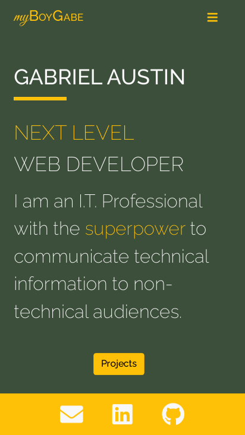

# Gabe's Portfolio - [www.myboygabe.com](http://www.myboygabe.com)

 

This is a fully responsive, mobile-friendly portfolio site that displays my work.

 

## Images of the Finished Product

**Cell Phone Image**  

**Tablet Image**  

**Desktop Image**  

 

### **Technology Used**

:heavy_check_mark:&nbsp;&nbsp; React  
:heavy_check_mark:&nbsp;&nbsp; Bootstrap  
:heavy_check_mark:&nbsp;&nbsp; Node Package Manager (NPM)  
:heavy_check_mark:&nbsp;&nbsp; Font Awesome  

## **To Do**

- [x] Fix text color - navbar
- [x] Break `App.js` into Components
- [x] Add Font Awesome mail icon and link to my email address
- [x] Link the navbar items to each page
- [x] Code the Contact page
- [x] Code the Resume page
- [x] Code the Projects page
- [x] Center the cards on the Projects page - mobile
- [x] Create downloadable PDF of resume
- [x] Have footer to stay at the bottom of the page
- [ ] ~~Code the About page~~
- [ ] ~~Code Contact page to look similar to Coming Soon page~~
- [ ] ~~Create Resume Scan with QR Code - need to add additional page~~
- [ ] ~~Add Easter Egg(s)~~

## **Bug(s)**
- [x] **B.01**: Reduce page loading speed for homepage and resume page
  - **Solution to B.01**: Route-level code splitting. Added lazy-loading to HomePage and Resume components.

## **Feature(s)**
- [x] **F.01**: Add images of the finished product to the `README.md` file
- [x] **F.02**: Add Open Graph data to meta tags

 
 

:octocat:&nbsp;&nbsp;Gabe's Portfolio&nbsp;&nbsp;:octocat:  
:bowtie:&nbsp;&nbsp;A Gabe A. Production&nbsp;&nbsp;:bowtie:
